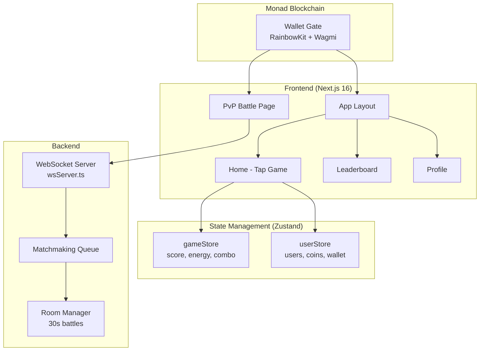
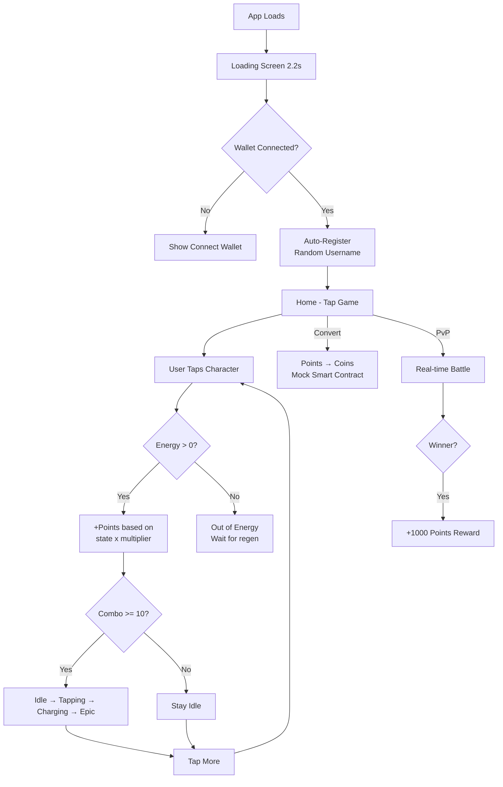
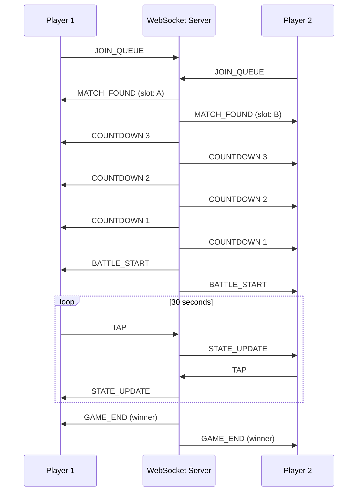
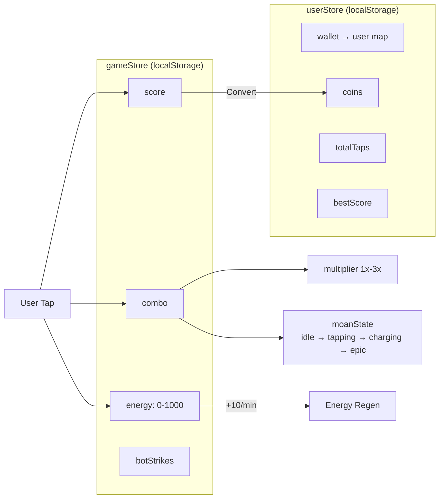
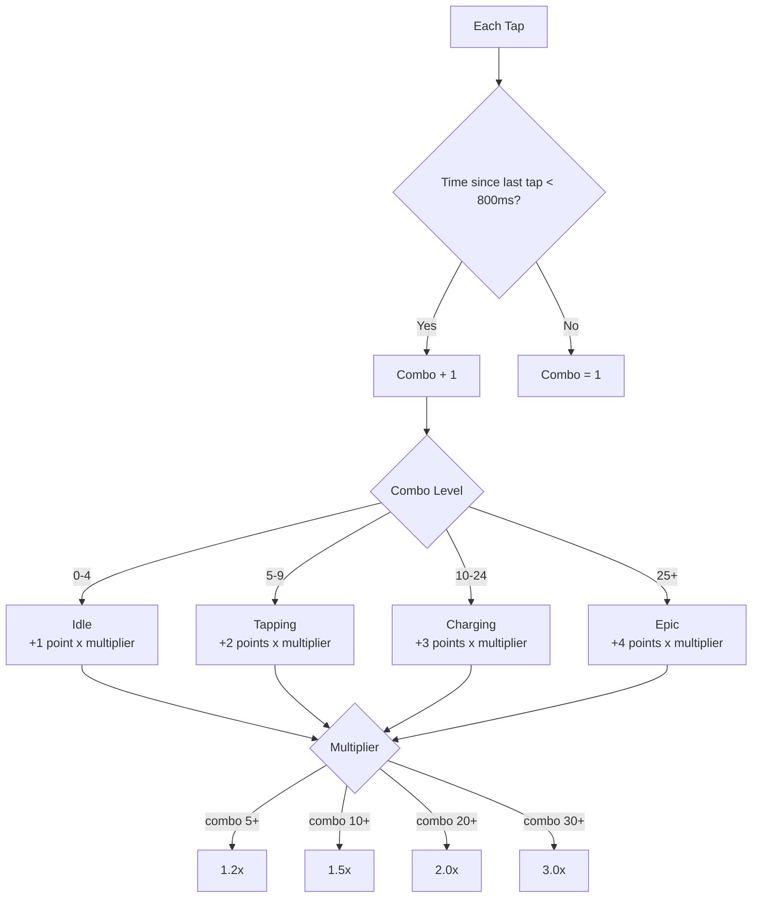
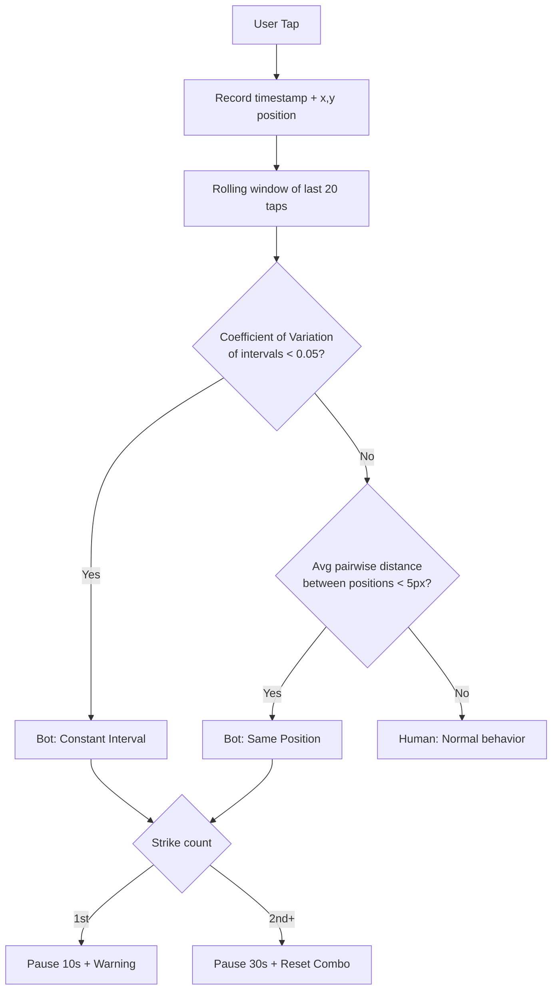

# MOANTAP — Tap-to-Earn Game on Monad

A mobile-first tap-to-earn game built with Next.js 16, featuring real-time PvP battles via WebSocket, wallet authentication, combo mechanics, and bot detection — deployed on the Monad blockchain.

---

Our Contract Address

```0x5144984bb6E57D50baD69CCBd17F78DDe7307304```
```https://testnet.monadvision.com/address/0x5144984bb6E57D50baD69CCBd17F78DDe7307304```

## Architecture Overview



## Game Flow



## PvP Battle Flow



## State Management



## Combo & Scoring System



## Bot Detection System



## Project Structure

```
monad-blitz/
├── src/
│   ├── app/
│   │   ├── (main)/          # Main app routes (with layout)
│   │   │   ├── page.tsx     # Home - Tap game
│   │   │   ├── leaderboard/ # PvP rankings
│   │   │   └── profile/     # User profile
│   │   ├── pvp/             # PvP battle (standalone layout)
│   │   └── layout.tsx       # Root layout
│   ├── components/
│   │   ├── fx/              # Visual effects (beam, particles, shake)
│   │   ├── layout/          # AppHeader, AppLayout, BottomNav, WalletGate
│   │   ├── pvp/             # PvP battle, countdown, matchmaking
│   │   ├── tap/             # MoanTap character
│   │   └── ui/              # Base UI (shadcn)
│   ├── config/              # RainbowKit + Wagmi config
│   ├── constants/           # Smart contract ABIs
│   ├── contexts/            # UserContext (wallet → user)
│   ├── hooks/               # useTapGame, usePvPSocket, useBotDetection
│   ├── lib/                 # tapLogic, wsClient, battleLogic, usernameGenerator
│   ├── stores/              # Zustand: gameStore, userStore
│   ├── styles/              # Design tokens (colors, gradients, spacing)
│   └── types/               # TypeScript: user, tap, pvp
├── server/                  # WebSocket server
│   ├── wsServer.ts          # Main WS server
│   ├── matchmaking.ts       # Queue + match logic
│   └── roomManager.ts       # Battle room lifecycle
├── packages/
│   └── smart-contracts/     # Solidity contracts (Foundry)
├── public/assets/           # Images, character sprites, backgrounds
└── railway.json             # Railway WS deploy config
```

## Tech Stack

| Category | Technology |
|----------|-----------|
| Framework | Next.js 16 (App Router, Webpack) |
| Language | TypeScript |
| UI | React 19, Tailwind CSS, Framer Motion |
| State | Zustand v5 (localStorage persist) |
| Wallet | RainbowKit 2.x + Wagmi 2.x + Viem 2.x |
| Blockchain | Monad |
| Real-time | WebSocket (ws) |
| Smart Contracts | Solidity + Foundry |
| Design | Custom design tokens, mobile-first |

## Getting Started

### Prerequisites

- Node.js 18+
- npm or yarn

### Install

```bash
git clone https://github.com/kikik27/monad-blitz.git
cd monad-blitz
npm install
```

### Environment Variables

Create `.env.local`:

```env
NEXT_PUBLIC_WALLETCONNECT_PROJECT_ID=your_project_id
NEXT_PUBLIC_WS_URL=ws://localhost:3001
```

### Run

```bash
# Start frontend
npm run dev

# Start WebSocket server (separate terminal)
npm run server:ws
```

Open [http://localhost:3000](http://localhost:3000).

### Build

```bash
npm run build
npm start
```

## Deployment

### Frontend → Vercel

```bash
npx vercel
```

Set environment variable in Vercel dashboard:
- `NEXT_PUBLIC_WS_URL` = your WebSocket server URL

### WebSocket Server → Railway

```bash
npm i -g @railway/cli
railway login
railway init
railway up
```

Railway auto-assigns `PORT` and provides a public `wss://` URL.

## Features

- **Tap-to-Earn** — Tap the character to earn points, combo multipliers up to 3x
- **4 Character States** — Idle, Tapping, Charging, Epic (visual + scoring changes)
- **Energy System** — 1000 max, -1 per tap, +10 regen per minute
- **Convert Points → Coins** — Mock smart contract interaction
- **Real-time PvP** — 30-second battles via WebSocket, winner gets +1000 points
- **Wallet Gate** — Must connect wallet (RainbowKit) to play
- **Auto Username** — Indonesian-themed random names (e.g. KucingTidur482)
- **Bot Detection** — Constant interval + same position detection with penalties
- **Mobile-first UI** — Bottom nav, underwater background, responsive layout
- **Persistent State** — Score, energy, coins, user data survive page reloads

## License

MIT
